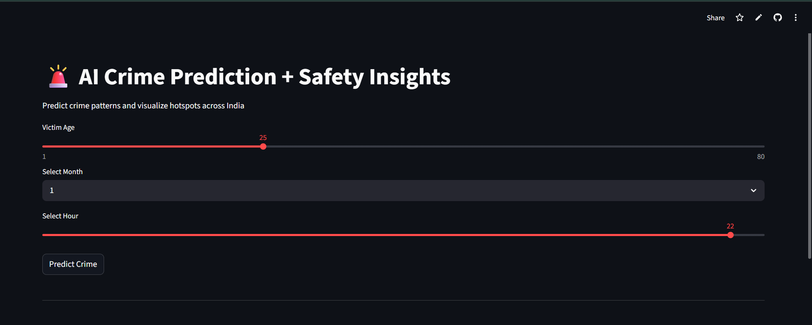
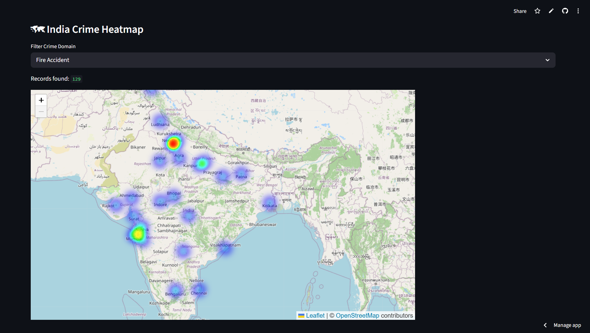

# AI-Powered Crime Prediction and Geographic Heatmap System

## Screenshots


### Home Page



### Prediction Result + Heatmap



## Live Demo

https://crime-predictor-trisha.streamlit.app/

## Live App

https://crime-predictor-trisha.streamlit.app/

## GitHub Repository

https://github.com/trishadas-25/crime-predictor

## Project Overview

This project predicts probable crime patterns using Machine Learning and visualizes geographic crime hotspots through an interactive India heatmap.

Features:

- Crime Prediction
- India Heatmap
- Risk Analysis
- Safety Suggestions
- Interactive Dashboard

## Technologies Used

- Python
- Streamlit
- Scikit-learn
- Folium
- Pandas
- Geopy

## Project Structure


```text
crime_predictor/
    app.py
    data/
    models/
    requirements.txt 
    PROJECT_REPORT.md